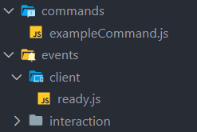
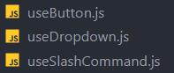
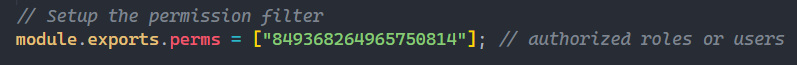

# Advanced and complete discord.js 13 handler

## Presentation

**DiscordJs13-handler** is the solution for all the discord.js developper who want a complete handler for slash commands

## Fonctionnalities

* Events and commands in differents files

<br>
* New useButton, useSlashCommand and useDropdown events

<br>
* Permissions configurable in each command file with a simple array


## How to use ?

#### Installation

* Node.js 16.6.0 or newer is required.
* Download the repo and run `npm i` to install the packages.
* Setup the `config.js` file with your bot's token, its ID and the ID of the guild where you will use the bot.

#### Add new slash-command

Create a new file in the commands folder then copy put this template :
```js
const { SlashCommandBuilder } = require('@discordjs/builders');

module.exports.run = async (client, interaction) => {
	// put your code here
};

module.exports.data = new SlashCommandBuilder()
    .setName('command')
	.setDescription('Command Description')

    .setDefaultPermission(false)

module.exports.perms = ["849368264965750814"];
```

You can setup the command with the [SlashCommandBuilder()](https://discordjs.guide/popular-topics/builders.html).
It's better if your file name is the same than your .setName()

the `module.exports.perms` is an array which can contain role's or user's ID.
**If you want to enable the permission restriction, you have to put `.setDefaultPermission(false)` to your SlashCommandBuilder as I did.**

#### Add new event

Create a new file called by the name of the event you want then copy this template :
```js
module.exports = async (client) => {
    // put your code here
};
```
You can sorte the events as you want in subfolder but to work, the events have to be in one (example: `./events/interaction/interactionCreate.js`)

**By default, each events return the parameter client as first, you can add the others parameter of each event after client. Refer to [discord.js docs](https://discord.js.org/#/docs/discord.js/stable/general/welcome) to know what are the parameters for each event.**
Example for guildMemberAdd:
```js
module.exports = async (client, member) => {
    // put your code here
};
```

Example for interactionCreate:
```js
module.exports = async (client, interaction) => {
    // put your code here
};
```

**Note :** don't edit the `system_dont_edit` folder.

#### Use the custom interaction events

The interactionCreate event is for me not really good, it's why, I created three new events more precise, you can use them as others events. But don't edit interactionCreate event if you want to use them.

| Event name        |         Parameters      | What is this ?    |
|-------------------|-------------------------|-------------------|
|     useButton     |  (client, interaction)  |  run when a button is clicked  |
|    useDropdown    |  (client, interaction)  |  run when a dropdown is clicked  |
|  useSlashCommand  |  (client, interaction)  |  don't edit ! it's to handle the commands in different files |

#### If you have any question, ask it on discord
`gaetan20#6791`